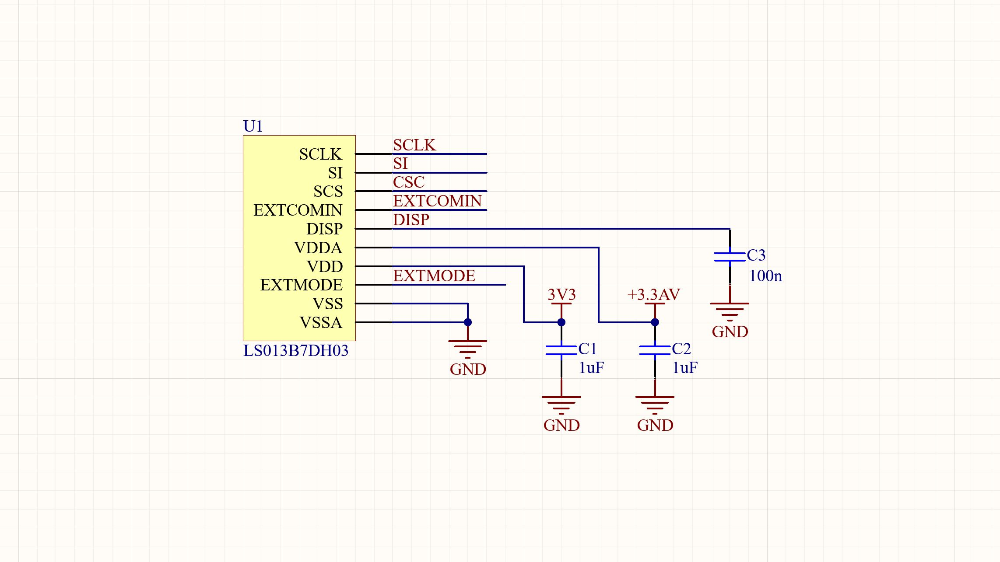

# LS013B7DH03_Sharp_Memory_Display
C library for LS013B7DH03 Sharp Memory Display

For the schematics I followed the manufacturer's recommendations.
Below is a screenshot of the wiring diagram.

**SCLK**     => SPI serial clock  
**SI**       => MOSI   
**CSC**      => Chip select line  
**EXTCOMIN** => External clock source pin  
**DISP**     => Display Enable  
**EXTMODE**  => Clock mode selection pin  

In this library I use [EXTMODE = H] for external clock selection. The EXTCOMIN is connected to a 50Hz 50% PWM signal generated by microcontroller.

**Useful documentation:** 
https://www.sharpmemorylcd.com/resources/SharpMemoryLCDTechnologyB.pdf  
https://www.sharpsde.com/fileadmin/products/Displays/Specs/LS013B7DH03_25Apr16_Spec_LD-28410A.pdf  
